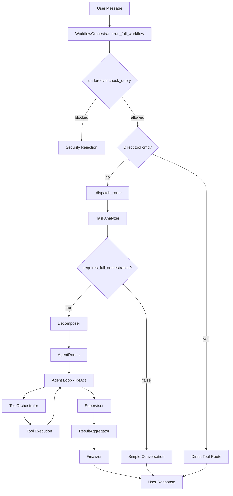

# Data Flow

This document describes how data moves through Morphix — from user message to final response — covering both the high-level orchestration path and the low-level streaming mechanics.

## High-Level Flow



### 1. Entry: `run_full_workflow()`

```python
# orchestration/workflows/orchestrator.py:270
async def run_full_workflow(session: Session) -> str | None:
    ctx = session.context
    events = session.events
    query = ctx.query
```

The entry point receives a `Session` dataclass combining `WorkflowContext` (immutable task state) and `WorkflowEvents` (callback interface). No UI framework objects are passed — the orchestrator is completely decoupled from PySide6.

### 2. Security Check

The `undercover.check_query()` method inspects the query for prohibited patterns. Blocked queries return `None` immediately, never reaching the LLM.

### 3. Direct Tool Fast Path

If the query matches `tool_name: action, key=val` (e.g., `git_manager: commit, message="fix bug"`) and the tool exists in the registry, the orchestrator skips all analysis and executes the tool directly:

```python
# orchestration/workflows/orchestrator.py:301
direct_tool = _parse_direct_tool_command(query)
if direct_tool:
    return await self._run_direct_tool(direct_tool, query, ...)
```

The tool name is validated against the registry to prevent false positives on natural language (e.g., `navega y analiza : URL` won't match because `navega` is not a registered tool).

### 4. Task Analysis

`TaskAnalyzer.analyze_task()` sends a structured prompt to the LLM (role=`fast`, temperature=0.0) asking it to classify the task:

```json
{
    "primary_type": "simple_conversation|creativo|analista|ejecutor|...",
    "complexity": "simple|medium|complex",
    "is_direct_code_execution": true/false,
    "requires_full_orchestration": true/false
}
```

Results are cached in an LRU cache (max 500 entries, TTL 300s) to avoid redundant LLM calls for repeated queries.

The `is_follow_up` flag injects context about the conversation being a continuation, which biases the analyzer toward lower complexity and modification-oriented classification:

```python
# orchestration/analyzer.py:29-35
if is_follow_up:
    follow_context = (
        "\n⚠️ CONTEXTO: Esta es una conversación DE CONTINUACIÓN..."
        "El usuario quiere MODIFICAR, EXTENDER o CORREGIR código ya existente."
    )
```

### 5. Decomposition

For complex tasks, `decompose_task()` (or `decompose_task_with_phases()` for coordinated workflows) breaks the task into 3–5 subtasks. Each subtask has a description and optionally a recommended agent type.

### 6. Agent Routing + Supervision

```python
# orchestration/workflows/orchestrator.py:818-836
for task in subtasks_list:
    best_agent = await agent_router.select_best_agent(
        desc, primary_type=primary_type, allowed_agents=allowed_agents
    )
    router_selections.append(best_agent)

corrected_agents = await WorkflowSupervisor.review_and_correct(
    task_analysis, router_selections, subtasks_list, allowed_agents
)
```

The `AgentRouter` maps subtasks to the best agent. The `WorkflowSupervisor` then reviews and corrects these assignments, acting as a sanity check before execution.

### 7. Agent Loop (ReAct)

Each subtask executes via `execute_subtask_safe()` → `execute_agent_loop()`. The loop:

1. Builds the system prompt with tool definitions and instructions
2. Calls the LLM (streaming preferred, non-streaming fallback)
3. Parses tool calls from the response
4. Executes tools via `safe_tool_call()`
5. Appends observations to the conversation history
6. Checks for stalls, clarification requests, or completion
7. Repeats until done or max iterations reached

```python
# orchestration/loop.py — simplified loop
while iteration < config.max_agent_iterations:
    full_text, tool_calls, finish_reason, reasoning = await _call_llm(messages, ...)
    if not tool_calls:
        break  # Natural completion
    actions_taken, modified, files, stalls, early = await _execute_tool_calls_and_check_stall(...)
    if early:
        break  # Stall detected
    iteration += 1
```

### 8. Aggregation + Finalization

`ResultAggregator.aggregate_results()` synthesizes all subtask results into a coherent response. `finalize_workflow()` persists the conversation to the database, generates a scorecard, and optionally auto-commits changes via Git.

## Context Management

`WorkflowContext` carries all task state as a dataclass:

```python
@dataclass
class WorkflowContext:
    query: str
    mode: str = "chat"
    conversation_history: list[dict] = field(default_factory=list)
    current_pdf_text: str = ""
    workspace: str = "main"
    project_root: str | None = None
    active_workflow: str = "default"
    force_agent: str | None = None
    allowed_tools: list[str] | None = None
    conversation_id: int | None = None
    is_follow_up: bool = False
    cancelled: bool = False
    last_clarification: str = ""
    blackboard: Any = None
```

Token budget management follows a tiered approach:

| Threshold | Action |
|-----------|--------|
| 70% of max (simple conversations) | Compress history |
| 80% of max (full orchestration) | Compress history |
| 90% of max (LLM calls) | Compress before sending to API |

Default `MAX_CONTEXT_TOKENS`: **128,000** (configurable via `.env`).

Compression uses `ContextManager.compress_history()` which preserves system messages and recent turns while trimming older content. Compressed target: 70% of max tokens.

## Streaming Data Flow

### Chunk Path: LLM → Controller → Accumulator → GUI

```mermaid
sequenceDiagram
    participant LLM as LLM API (SSE)
    participant Ctrl as ModelsController
    participant Loop as _accumulate_stream
    participant GUI as ChatBlock

    LLM->>Ctrl: SSE stream (OpenAI-compatible)
    Ctrl->>Ctrl: _stream_openai_async()
    Ctrl->>Loop: yield StreamChunk(text="Hel")
    Ctrl->>Loop: yield StreamChunk(text="lo")
    Ctrl->>Loop: yield StreamChunk(tool_name="file_manager", tool_call_id="call_1")
    Ctrl->>Loop: yield StreamChunk(tool_arguments='{"action":', tool_call_id="call_1")
    Ctrl->>Loop: yield StreamChunk(tool_arguments='"write"}', tool_call_id="call_1")
    Ctrl->>Loop: StreamChunk(finish_reason="stop", is_done=True)
    Loop->>GUI: on_stream_chunk("Hel")
    Loop->>GUI: on_stream_chunk("lo")
    Note over GUI: Debounce 70ms → setMarkdown
    Loop->>Loop: Reassemble tool calls by index
    Loop->>GUI: Emit agent/tool messages
```

### StreamChunk Structure

```python
# llm/controller.py:45-55
@dataclass
class StreamChunk:
    text: str | None = None
    tool_name: str | None = None
    tool_arguments: str | None = None
    tool_call_id: str | None = None
    finish_reason: str | None = None
    reasoning_content: str | None = None
    usage: dict[str, int] | None = None
    is_done: bool = False
```

### Tool-Call Argument Accumulation (Sprint 25b Fix)

A critical detail in streaming tool calls: the OpenAI/DeepSeek SSE protocol sends tool-call deltas where **only the first delta carries `id` and `name`**. Subsequent deltas have `id=None` and only `function.arguments` fragments. The controller accumulates by **stable `index`**, not by `id`:

```python
# llm/controller.py:394-419 — key logic
if delta.tool_calls:
    for tc in delta.tool_calls:
        idx = getattr(tc, "index", None)
        tc_id = getattr(tc, "id", None)
        key = idx if idx is not None else tc_id  # Use index as primary key
        if key is None:
            continue
        if key not in tool_acc:
            tool_acc[key] = {
                "id": tc_id or f"call_{len(tool_acc)}",
                "name": "",
                "arguments": "",
            }
        entry = tool_acc[key]
        if tc_id:
            entry["id"] = tc_id  # Update real ID when available
        func = getattr(tc, "function", None)
        if func:
            if getattr(func, "name", None):
                entry["name"] = func.name
            if getattr(func, "arguments", None):
                entry["arguments"] += func.arguments
```

The **accumulator** in `_accumulate_stream()` (`orchestration/loop.py:62-132`) then reassembles tool calls from the chunk stream. It handles the edge case where arguments arrive before the name by deferring until the name is known:

```python
# orchestration/loop.py:86-108
if chunk.tool_name and chunk.tool_call_id:
    tid = chunk.tool_call_id
    if tid not in tool_call_by_id:
        tool_call_by_id[tid] = {
            "id": tid,
            "function": {"name": chunk.tool_name, "arguments": ""},
        }
    else:
        tool_call_by_id[tid]["function"]["name"] = chunk.tool_name

if chunk.tool_arguments and chunk.tool_call_id:
    tid = chunk.tool_call_id
    if tid not in tool_call_by_id:
        if chunk.tool_name:
            tool_call_by_id[tid] = {
                "id": tid, "function": {"name": chunk.tool_name, "arguments": ""},
            }
        else:
            continue  # Defer until name arrives
    tool_call_by_id[tid]["function"]["arguments"] += chunk.tool_arguments
```

### GUI Debounce: 70ms Batch Rendering

`ChatBlock.update_text()` coalesces streaming updates to prevent O(n²) re-renders. `QTextBrowser.setMarkdown()` re-parses and re-lays-out the entire document on every call, so rendering on every token would be quadratic.

```python
# desktop/widgets/chat_bubble.py:157-171
def update_text(self, text: str):
    self._text = text
    self._pending_text = text
    if self._stream_timer is None:
        self._stream_timer = QTimer(self)
        self._stream_timer.setSingleShot(True)
        self._stream_timer.timeout.connect(self._flush_stream)
    if not self._stream_timer.isActive():
        self._stream_timer.start(70)  # Render at most once per ~70ms
```

At stream end, `flush_stream()` renders any remaining pending text immediately.

### Non-Streaming Path (Comparison)

The non-streaming path (`call()`) uses the OpenAI SDK's non-streaming endpoint. Tool calls are returned already assembled — no accumulation needed:

```python
# llm/controller.py:184
response = client.chat.completions.create(**call_kwargs)
# response.choices[0].message.tool_calls is already complete
```

Streaming is preferred for UX (users see text as it's generated), but the non-streaming fallback kicks in when:
- Retries exhausted (streams fail and can't be recovered)
- The provider doesn't support streaming
- `stream=False` is explicitly requested

## Events System

The orchestrator communicates with the UI exclusively through `WorkflowEvents` callbacks:

```python
@dataclass
class WorkflowEvents:
    on_system_message: Callable[[str], Awaitable[None]] | None = None
    on_assistant_message: Callable[[str], Awaitable[None]] | None = None
    on_user_message: Callable[[str], Awaitable[None]] | None = None
    on_stream_chunk: Callable[[str], Awaitable[None]] | None = None
    on_diagram_update: Callable[[str, Any], Awaitable[None]] | None = None
    on_stats_update: Callable[[dict], Awaitable[None]] | None = None
    on_ui_refresh: Callable[[], Awaitable[None]] | None = None
    on_approval_required: Callable[[str, dict[str, Any]], Awaitable[bool]] | None = None
    on_agent_message: Callable[[str, str, str], Awaitable[None]] | None = None
```

Helper functions (`emit_system()`, `emit_stats()`, `emit_stream_chunk()`, etc.) fire callbacks safely — if a callback is `None` or raises an exception, it's silently skipped rather than crashing the workflow.
