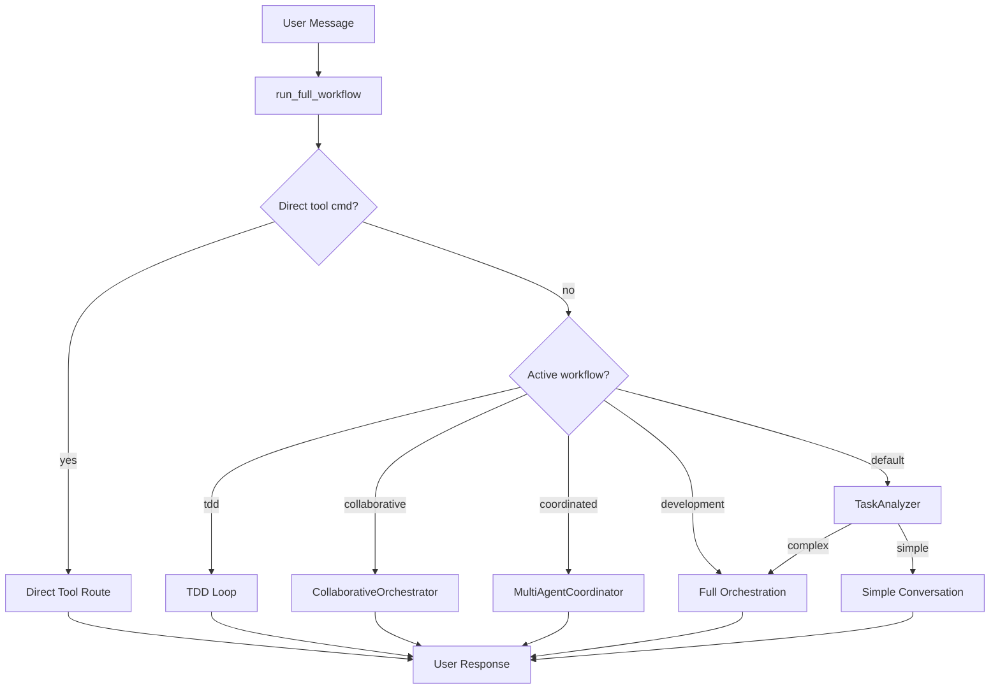

# Architecture Overview

Morphix follows a **layered architecture** with strict boundaries between subsystems. Each layer depends only on the layers below it — never upward — ensuring clear separation of concerns, testability, and the ability to swap implementations without cascading changes.

## Layer Map

| Layer | Directory | Role |
|-------|-----------|------|
| **Core** | `core/` | Business logic single source of truth. Database engine, config, memory (FAISS), security (undercover mode, encryption), path resolution, workspace management, context compression. No UI dependencies. |
| **LLM** | `llm/` | LLM abstraction. `ModelsController` (retries, backoff, circuit breaker), `LLMProvider` (OpenAI/DeepSeek/Grok ↔ Ollama routing), parser (JSON extraction), prompts, offline mode. Exposes `StreamChunk` dataclass for unified streaming. |
| **Agents** | `agents/` | Agent system. Registry (global + per-workspace), YAML profile loader, base execution, `AgentsService`, audit trails. Agent profiles declare tools, system prompts, and model preferences. |
| **Tools** | `tools/` | Tool implementations. Dynamic `.py` file loading (global + per-workspace), decorator-based registration, `ToolOrchestrator` (token budgets), specs (function-calling schemas), 12 registered tools. |
| **Orchestration** | `orchestration/` | Workflow brains. `WorkflowOrchestrator` (4+ routes), agent loop (ReAct), `TaskAnalyzer`, `Decomposer`, `AgentRouter`, `Supervisor`, `ResultAggregator`, `Finalizer`. Sub-package `workflows/` holds collaborative, coordinated, TDD, and blackboard variants. |
| **Desktop** | `desktop/` | PySide6 GUI. Services layer (`desktop/services/`) for config, dashboard, analytics, history. Widgets: `ChatBlock`, `MaestroTab`. Stateless — all state lives in `orchestration/`. |

## How a Task Flows

1. **`WorkflowOrchestrator.run_full_workflow()`** receives a `Session` (context + events) and performs security checks via `undercover.check_query()`.

2. **Direct tool detection**: If the message matches `tool_name: action, key=val` format and the tool exists in the registry, it takes the fast path — one tool call, immediate response.

3. **Template dispatch** (`_dispatch_route()`): Evaluates the active workflow template and dispatches to one of:

    | Route | Trigger | Description |
    |-------|---------|-------------|
    | TDD Loop | `active_workflow == "tdd"` | Autonomous test-driven development cycle — write test, run, fix, repeat |
    | Collaborative | `template.type == "collaborative"` | Panel of agents contribute in parallel rounds |
    | Coordinated | `template.type == "coordinated"` | Phase-aware DAG execution with shared blackboard |
    | Development | `template.type == "development"` | Full orchestration: decompose → route → execute → supervise → aggregate |
    | Default | No matching template | `TaskAnalyzer` decides: simple conversation or full orchestration |

4. **Agent Loop (ReAct)**: The core execution unit. Each agent follows *Reasoning → Action → Observation → Adjust*. The loop calls `execute_agent_loop()` in `orchestration/loop.py`, which:
    - Builds tool definitions and instructions from `tools/specs.py`
    - Calls the LLM (streaming or non-streaming) with function-calling schemas
    - Executes returned tool calls via `safe_tool_call()`
    - Detects stalls (2+ iterations without file modifications → early exit)
    - Supports clarification requests (`ask_clarification` pauses workflow)
    - Default max iterations: 8 (`MAX_AGENT_ITERATIONS`)

5. **Tool Orchestrator**: `ToolOrchestrator` in `tools/orchestrator.py` manages token budgets per tool and coordinates approval requirements (`on_approval_required` callback).

6. **Supervisor → Aggregator → Finalizer**: After all subtasks execute, the `WorkflowSupervisor` reviews agent assignments, `ResultAggregator` synthesizes results into a coherent response, and `finalize_workflow()` persists the conversation and scorecard.

## Why This Architecture

### Layer Isolation

Each layer has no knowledge of layers above it. `core/` doesn't import from `orchestration/`. `orchestration/` doesn't import from `desktop/`. The `WorkflowEvents` dataclass decouples the orchestrator from any specific UI framework — PySide6, CLI, or tests all implement the same callback interface.

### Workspace Isolation (PostgreSQL Schemas)

Each workspace is a **separate PostgreSQL schema** with its own tables (`Conversation`, `Message`, `Workflow`, `User`, `PausedSession`). The `search_path` mechanism routes queries transparently. This provides:

- **Data isolation** — no cross-workspace data leaks
- **No migration conflicts** — schemas are created independently
- **Simple cleanup** — `DROP SCHEMA ... CASCADE`

### Pluggable Tools and Agents

Tools live as standalone `.py` files in `tools/` (global) and `workspaces/<name>/tools/` (per-workspace). Loading uses decorator-based registration (`@tools_registry.register("name")`). Agents follow the same pattern via YAML profiles in `templates/agents/` and `workspaces/<name>/agents/`.

### Multiple Execution Strategies

Not every task needs full orchestration. A simple question gets a direct agent response. A `git commit` gets the fast direct-tool path. A complex multi-file feature gets decomposed into subtasks, routed to specialized agents, supervised, and aggregated. The routing layer adapts the execution strategy to the task complexity.
