# Agents Layer

The `agents/` layer manages agent profiles, registration, loading, and the execution lifecycle. It provides a workspace-aware system where global built-in agents coexist with per-workspace custom agents defined in YAML templates.

## Module Inventory

### Registry (`registry.py`)

```python
class AgentsRegistry:
    # Instanciable, not a singleton. The global legacy instance 'agents_registry'
    # is kept for backward compat; for tests, create AgentsRegistry() directly.

    def register_global(agent_type: str, profile: dict | None = None)
    def register_workspace_agent(agent_type: str, func: Callable, profile: dict | None = None)
    def clear_workspace_agents()
    def get_agent(agent_type: str) -> Callable | None
    def get_profile(agent_type: str) -> dict | None
    def list_agents() -> dict[str, Callable]
    def list_global_agents() -> dict[str, Callable]
    def clear()
```

Key behaviors:

- **Workspace-overrides-global**: `get_agent()` and `get_profile()` check workspace agents first, falling back to global. This allows per-workspace agent customization without touching global definitions.
- **Instance isolation**: The `AgentsRegistry` class can be instantiated fresh for tests, avoiding state leakage.
- **Normalization**: Agent names are lowercased on registration (`agent_type.lower()`).

### Loader (`loader.py`)

```python
def load_workspace_agents(workspace_name: str)
def unload_workspace_agents()
```

- `load_workspace_agents()`: Scans `workspaces/<name>/agents/*.yaml`, skips `_`-prefixed files (templates like `_FULL_TEMPLATE.yaml`), parses each YAML profile, wraps the agent via `_execute_specialized_agent()`, and registers it with `agents_registry.register_workspace_agent()`.
- `unload_workspace_agents()`: Calls `agents_registry.clear_workspace_agents()` — removes all workspace-scoped agents without touching globals.

Templates are copied from `templates/agents/` to the workspace on first switch (handled by `core/workspaces.py`). Each agent YAML file defines the profile and includes `name`, `type`, `system_prompt`, `length_guidance`, `temperature`, `tools`, `keywords`, `priority`, and `model_role`.

### Profiles (`profiles.py`)

Defines the global `AGENT_PROFILES` list. Only **one** profile is global:

- **`conversacional`** — the universal minimum fallback agent (priority 10, tools: none, temperature 0.4, model_role: `agent`).

All other agent profiles (developer, analista, moderador, architect) are defined per workspace in `workspaces/<name>/agents/*.yaml`. Their initial templates live in `templates/agents/` for copying during workspace creation. The YAML-based design allows users to add custom agents per workspace without modifying global code.

### Base (`base.py`)

```python
async def _execute_specialized_agent(
    agent_type: str,
    task: str,
    history: list,
    pdf_text: str = "",
    tools_output: str = "",
    extra_tool_instructions: str = "",
    on_stream_chunk=None,
) -> str
```

Core agent execution function used by all agents (global and workspace). Execution flow:

1. **Profile lookup** — Retrieves the agent profile from `AgentsRegistry`
2. **User profile injection** — FAISS-based user memory is injected as context
3. **Last memory key** — If the profile defines `last_memory_key`, the previous result is prepended
4. **System prompt construction** — Combines `system_prompt`, `length_guidance`, and anti-frustration prompt
5. **Context compression** — Uses `ContextManager.compress_history()` at 60% budget
6. **Undercover identity injection** — Security layer wraps messages
7. **Frustration detection** — If user frustration is detected, injects a calming prompt
8. **LLM call** — Uses profile's `model_role` and `temperature`; supports streaming via `on_stream_chunk`
9. **Self-reflection** (optional) — If `agent_self_reflection` is enabled, a critique pass improves the response
10. **Memory persistence** — Saves result under `last_memory_key`
11. **Anti-distillation** — `undercover.get_safe_response()` protects final output

The file also auto-registers all global agents from `AGENT_PROFILES` at import time using a closure pattern to avoid lambda variable capture issues.

### Service (`service.py`)

```python
class AgentsService:
    @staticmethod
    def get_available_agents() -> list[str]
    @staticmethod
    async def execute_agent(agent_type: str, query: str, history: list, on_stream_chunk=None) -> str
    @staticmethod
    async def categorize_task(task: str) -> str
```

- `get_available_agents()`: Returns agent names from the registry (workspace + global combined)
- `execute_agent()`: Looks up an agent function and executes it; supports streaming via the specialized agent path
- `categorize_task()`: Uses the LLM to classify a task into one of the available agent names; returns `fallback_agent` on failure

### Audit (`audit.py`)

```python
def log_operation(operation: str, details: str = "", user: str = "morphix", success: bool = True) -> None
def get_recent_operations(limit: int = 50) -> list[dict]
```

Logs sensitive operations (bash commands, file deletions, git force pushes) to `memory/logs/audit.jsonl` as JSON-lines entries with timestamps in UTC. Each entry records: `timestamp`, `operation`, `details` (truncated to 500 chars), `user`, and `success`.

## Agent Profiles

| Agent | Type | Model Role | Tools Allowed | Best For |
|-------|------|------------|---------------|----------|
| **developer** | development | `agent` | file_manager, git_manager, bash_manager, lsp_manager, code_exec, test_runner, diff_editor | Writing code, implementing features, fixing bugs, refactoring |
| **analista** | analysis | `reasoning` | file_manager, lsp_manager, code_search, web_search | Code review, architecture analysis, risk evaluation (read-only) |
| **architect** | analysis | `reasoning` | file_manager, lsp_manager, code_search, web_search | System design, module boundaries, pattern selection, implementation plans (read-only) |
| **moderador** | moderator | `reasoning` | _(none)_ | Facilitating multi-agent debate, building consensus, synthesizing conclusions |
| **conversacional** | conversational | `agent` | _(none)_ | Small talk, greetings, profile questions, casual conversation |

**Profile attributes per agent:**

| Attribute | developer | analista | architect | moderador | conversacional |
|-----------|-----------|----------|-----------|-----------|----------------|
| Temperature | 0.2 | 0.2 | 0.2 | 0.4 | 0.4 |
| Priority | 70 | 55 | 58 | 1 | 10 |
| Read-only | No | Yes | Yes | N/A | N/A |
| Max output | 800 words | 600 words | 700 words | 300 words | 2-3 paragraphs |

**Priority** determines agent selection when multiple agents match: higher priority wins. The developer (70) is the default for code tasks; the conversacional (10) is the catch-all fallback.

## Agent Lifecycle

```mermaid
graph LR
    A[YAML Template] --> B[load_workspace_agents]
    B --> C[AgentsRegistry.register_workspace_agent]
    C --> D[agents_registry.get_agent / get_profile]
    D --> E[_execute_specialized_agent]
    E --> F[LLM call with profile config]
    F --> G[Self-reflection optional]
    G --> H[Memory persistence]
    H --> I[Anti-distillation filter]
    I --> J[AgentRouter.select_best_agent]
```



1. **Template loaded** — YAML profiles from `templates/agents/` are copied to `workspaces/<name>/agents/` on first workspace switch
2. **Registered** — Each agent YAML is parsed and registered via `register_workspace_agent()`; global agents are auto-registered from `AGENT_PROFILES` at module import
3. **Lookup priority** — Workspace agents override global agents with the same name; `get_agent()` and `get_profile()` check workspace first
4. **Execution** — `_execute_specialized_agent()` handles the full lifecycle: context injection, compression, frustration detection, LLM call, self-reflection, memory write
5. **Routing** — `AgentRouter.select_best_agent()` uses cached LLM calls to pick the best agent per subtask
6. **Supervision** — `WorkflowSupervisor.review_and_correct()` verifies agent assignments against keyword matching (controlled by `AUTO_FIX_LEVEL`)

## Workspace Agent Isolation

When switching workspaces:

1. `unload_workspace_agents()` clears all workspace-scoped agents from the registry
2. The new workspace's `agents/*.yaml` files are loaded via `load_workspace_agents()`
3. Global agents remain untouched, providing a reliable fallback layer
4. Workspace-specific agent overrides (e.g., a custom developer with different tools) take precedence over globals
