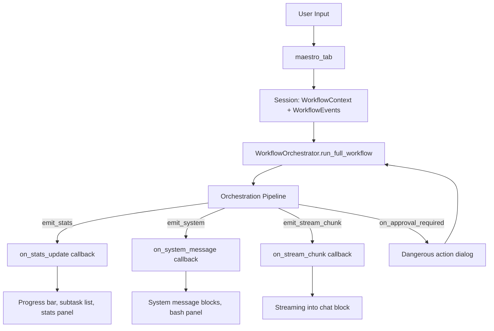

# Desktop Layer

The `desktop/` layer is the PySide6 GUI — the user-facing interface for Morphix. It uses a sidebar + stacked-widget architecture with business logic separated into services, and reusable UI components in a widgets directory.

## Module Inventory

### Main Window (`main_window.py`)

```python
class MainWindow(QMainWindow):
    # Tab wiring: dashboard, maestro, editor, analytics, history, config
    # project_changed signal integration
    # Window management, dark theme
```

- **Sidebar navigation**: Left sidebar (200px `QListWidget`) with icons navigates between 6 panels via `QStackedWidget`
- **Dark theme**: Applies a custom `DARK_PALETTE` (deep blacks and blues: `#0F0F0F`, `#1A1A1A`, `#1066ae`)
- **Login dialog**: `LoginDialog(QDialog)` — master password entry with SHA-256 hash verification; prevents access without authentication
- **Status bar**: `QStatusBar` with agent/workspace/project info
- **Async bridge**: Uses `desktop.async_helpers.run_async` to run coroutines from Qt slots
- **Window management**: Save/restore geometry, minimize to tray support (planned)

### Maestro Tab (`maestro_tab.py`)

The primary interaction tab — a 3-column cockpit with resizable splitter (sprint 25 design):

| Column | Width | Content |
|--------|-------|---------|
| **Left** (Ejecución) | ~280px (resizable) | Progress bar (`QProgressBar`), stats panel, subtask list with status icons (✅🔵❌⏳), modified files list |
| **Center** (Conversación) | Flexible | Chat blocks with streaming markdown rendering, user input field, send button |
| **Right** (Detalle) | ~350px (resizable) | `QTabWidget` with 4 sub-tabs: **Agentes**, **Diagrama**, **Log**, **Bash** |

**Features:**

- **Agent picker**: `QComboBox` for manual agent selection; falls back to `AgentRouter` when "Auto" is selected
- **Mode switching**: Chat mode (simple conversation) vs Orquestar mode (full orchestration) — toggled by button
- **Top bar**: Status display (estado · modo · proyecto · agente) + action buttons (clear, export, stop)
- **Streaming**: Real-time streaming into chat blocks via the `on_stream_chunk` event; debounced rendering (~70ms)
- **Subtask list**: Driven by the `subtask_list` key in `emit_stats` payloads; updates after each subtask completes
- **Clarification handling**: Renders the agent's question as a special message; user's answer injected back into the paused loop
- **Conversation continuity**: Follow-up messages in existing conversations load full context including agent/tool messages
- **Progress bar**: Shows `subtasks_completed / subtasks_total` during orchestration

### Dashboard Tab (`dashboard_tab.py`)

- **Agent cards**: Clickable cards for each of the 5 agents (developer, analista, moderador, conversacional, architect) — sets `force_agent`
- **Workflow cards**: Clickable cards for 4 workflow types (development, coordinated, collaborative, tdd) — switches the active workflow
- **Stats panel**: Shows total conversations, workflows run, tokens consumed, active workspace
- **Quick start**: Selecting a card auto-fills the maestro tab's input or switches context

### Editor Tab (`editor_tab.py`)

```python
# Layout: QTreeView (~280px) + QPlainTextEdit (flexible)
```

- **File tree**: `QTreeView` + `QFileSystemModel` showing the active project directory
- **Hidden files filtered**: `.git`, `__pycache__`, `.codebase_cache`, `__pycache__`, node_modules, .venv
- **Auto-refresh**: Listens for file system changes when agents create/modify files
- **Editor**: `QPlainTextEdit` with basic save/load
- **Operations**: Open/view, edit, save (with path safety — never writes outside workspace), create file/folder, rename, delete
- **No syntax highlighting** (v1 — planned for later)

### Analytics Tab (`analytics_tab.py`)

- **Usage charts**: Token consumption over time, tool call frequency, agent usage distribution
- **Metrics**: Powered by `core.metrics` system — renders historical data
- **Time range**: Filterable by day, week, month

### Config Tab (`config_tab.py`)

- **Environment variable editor**: Reads from `.env`, allows editing and saving
- **Connection status**: PostgreSQL, Redis, Ollama connectivity indicators (green/red dots)
- **API key management**: Masked display with edit capability
- **Settings display**: Shows computed settings from `core.config.Settings`

### History Tab (`history_tab.py`)

- **Fixed 2-column layout**: Conversation list (left) + conversation detail (right)
- **Filters**: By workspace, date range, workflow type, agent
- **Search**: Text search across conversation titles/queries
- **Export**: md (markdown), json, pdf, html (with pygments syntax highlighting for code blocks)
- **Pagination**: Infinite scroll with "Load more" button

### Events (`events.py`)

Signal bridge connecting orchestration events to Qt:

- **`project_changed`**: Emitted when the active project changes — triggers file tree refresh in editor tab
- **Workflow events**: Bridges `WorkflowEvents` callbacks (on_system_message, on_stream_chunk, etc.) to PySide6 signals for thread-safe UI updates

### Async Helpers (`async_helpers.py`)

```python
def run_async(coro) -> Any
```

Qt-asyncio integration utilities. Runs coroutines from Qt's event loop using `QTimer` and `asyncio.ensure_future()`. Provides a clean bridge between PySide6's synchronous signal/slot system and Morphix's async orchestration.

## Services (`desktop/services/`)

Business logic separated from UI for each tab:

| Service | File | Responsibility |
|---------|------|----------------|
| **Config Service** | `config_service.py` | Environment variable CRUD, connection testing, settings validation |
| **Dashboard Service** | `dashboard_service.py` | Agent/workflow card data, stats aggregation, quick-start logic |
| **Analytics Service** | `analytics_service.py` | Metrics retrieval, chart data preparation, time-range filtering |
| **History Service** | `history_service.py` | Conversation CRUD, export formatting (md/json/pdf/html), search/filter |

The service layer ensures the UI files remain thin presentation logic — all data access, formatting, and business rules live in services.

## Widgets (`desktop/widgets/`)

| Widget | File | Description |
|--------|------|-------------|
| **Chat Block** | `chat_bubble.py` | Full-width dense message blocks with role headers and streaming support |
| **Agent Panel** | `agent_panel.py` | Agent info/status display with capability overview |
| **Bash Panel** | `bash_panel.py` | Terminal-output display for bash_manager results |

### Chat Block (`chat_bubble.py`)

- **Markdown rendering**: Converts markdown to rich text for display
- **Streaming debounce**: ~70ms debounce to prevent UI choking during fast streaming
- **Browser reference caching**: Reuses rendered components for performance
- **Role headers**: Bold colored labels ("You" in accent blue, "Morphix" in success green) at top of each message block
- **Full-width design**: No bubble styling — transparent background, full-width blocks for dense conversation display
- **Timestamp**: UTC time displayed beside the role header

### Agent Panel (`agent_panel.py`)

- **Info display**: Agent name, type, allowed tools, model role, temperature
- **Status indicator**: Active/idle/error states
- **Quick-select**: Click to set as `force_agent`

### Bash Panel (`bash_panel.py`)

- **Terminal output**: Monospace text display for bash command results
- **Auto-scroll**: Follows new output
- **Error highlighting**: Red text for non-zero exit codes
- **Live updates**: Connected to `emit_system` events for real-time bash output

## UI Event Flow



The UI never directly calls orchestration functions. Instead, it:

1. Creates a `Session` with `WorkflowContext` (user input, settings) and `WorkflowEvents` (callbacks wired to Qt signals)
2. Passes the `Session` to `WorkflowOrchestrator.run_full_workflow()`
3. The orchestrator calls the appropriate event callbacks, which are thread-safely dispatched to Qt's main thread
4. The UI renders updates reactively — no polling, no direct coupling

This design keeps the orchestration layer testable without a GUI and the GUI replaceable without touching business logic.
