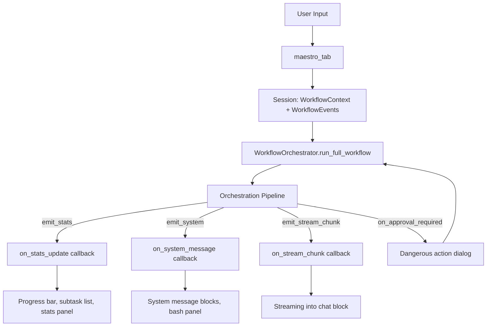

# Desktop Layer

The `desktop/` layer is the PySide6 GUI — the user-facing interface for Morphix. It uses a sidebar + stacked-widget architecture with business logic separated into services, and reusable UI components in a widgets directory.

## Module Inventory

### Main Window (`main_window.py`)

```python
class MainWindow(QMainWindow):
    # Tab wiring: dashboard, maestro, historial, editor, config, analytics, memoria, bots
    # project_changed signal integration
    # Window management, dark theme
```

- **Sidebar navigation**: Left sidebar `QListWidget` with icons navigates between 8 panels via `QStackedWidget` (sidebar items and stack pages are aligned by index — a page without a sidebar item would be unreachable)
- **Dark theme**: Applies a custom `DARK_PALETTE` (deep blacks and blues: `#0F0F0F`, `#1A1A1A`, `#1066ae`)
- **Login dialog**: `LoginDialog(QDialog)` — master password entry with SHA-256 hash verification; prevents access without authentication
- **Status bar**: `QStatusBar` with agent/workspace/project info
- **Async bridge**: Uses `desktop.async_helpers.run_async` to run coroutines from Qt slots
- **Window management**: Save/restore geometry, minimize to tray support (planned)

### Maestro Tab (`maestro_tab.py`)

The primary interaction tab — a 2-column layout with a resizable splitter (2026-08 redesign):

| Column | Width | Content |
|--------|-------|---------|
| **Left** (Chat) | Flexible (~3/5) | Chat blocks with streaming markdown rendering, agent debate blocks, user input field, send button |
| **Right** (Actividad unificado) | ~1/5 (resizable) | Collapsible sections: **Ejecución** (progress bar + stat chips), **Subtareas**, **Archivos creados** — plus a `QTabWidget` below: **Diagrama** (phase cards derived from stats), **Log**, **Bash** (hidden when the active workflow's allowlist excludes `bash_manager`, e.g. collaborative) |

**Features:**

- **Agent picker**: `QComboBox` for manual agent selection; "Auto" (value `None`) lets the execution path pick its default/fallback agent
- **Mode switching**: Chat mode (simple conversation) vs Orquestar mode (full orchestration) — toggled by button
- **Top bar**: Compact single row (estado · modo · proyecto · agente) + action buttons (clear, export, stop) with tooltips + active-workflow label
- **Streaming**: Real-time streaming into chat blocks via the `on_stream_chunk` event; debounced rendering (~70ms)
- **Subtask list**: Driven by the `subtask_list` key in `emit_stats` payloads; updates after each subtask completes
- **Stat chips**: All execution paths emit the same normalized stats contract (`WorkflowEmitter`) — elapsed/tokens/agent/status/phase chips never show stale placeholders
- **Status banner**: Errors and clarification pauses render as a colored banner above the input (system messages stay in the Log)
- **Clarification handling**: Renders the agent's question as a special message; user's answer injected back into the paused loop
- **Conversation continuity**: Follow-up messages in existing conversations load full context including agent/tool messages
- **Progress bar**: Shows `subtasks_completed / subtasks_total` during orchestration

### Dashboard Tab (`dashboard_tab.py`)

- **Agent cards**: Clickable cards for each of the 5 agents (developer, analista, moderador, conversacional, architect) — sets `force_agent`
- **Workflow cards**: Clickable cards for 4 workflow types (development, coordinated, collaborative, tdd) — switches the active workflow
- **Stats panel**: Shows total conversations, workflows run, tokens consumed, active workspace
- **Quick start**: Selecting a card auto-fills the maestro tab's input or switches context

### Editor Tab (`editor_tab.py`)

```python
# Layout: QTreeView (~280px) + QPlainTextEdit (flexible)
```

- **File tree**: `QTreeView` + `QFileSystemModel` showing the active project directory
- **Hidden files filtered**: `.git`, `__pycache__`, `.codebase_cache`, `__pycache__`, node_modules, .venv
- **Auto-refresh**: Listens for file system changes when agents create/modify files
- **Editor**: `QPlainTextEdit` with basic save/load
- **Operations**: Open/view, edit, save (with path safety — never writes outside workspace), create file/folder, rename, delete
- **No syntax highlighting** (v1 — planned for later)

### Analytics Tab (`analytics_tab.py`)

- **Real-time metrics**: Form with uptime, total tokens, workflows, success rate, LLM/tool calls, rate-limited counters — powered by `core.metrics`
- **Rate limiter status**: minute/hour usage vs limits
- **Consumption-based refresh**: the refresh timer is born STOPPED — `▶ Actualizar` / `⏹ Detener` toggle with an immediate first read; `hideEvent` auto-stops the timer; indicator `● en vivo` / `○ detenido · últ. HH:MM:SS`

### Memoria Tab (`memoria_tab.py`)

- **Memory browser**: list → detail → delete for memory entries, via `desktop/services/memoria_service.py` (Qt-free wrapper over the memory inspection handlers)
- **Delete always confirms**: the service requires `confirm_delete=True`; the human confirmation lives in a `QMessageBox` in the GUI
- **Refresh button** (`⟳`) and auto-refresh on `workspace_changed`

### Bots Tab (`bots_tab.py`)

- **Container with 3 sub-tabs** (`QTabWidget`): `RosterPane` (bot roster), `RoutinesPane` (scheduled routines with create/edit dialog and semantic colors), `GroupsPane` (group rooms with a shared log `QTextBrowser`)
- **Bot CRUD via YAML**: create/edit/clone write the workspace bot YAML (`workspaces/<ws>/bots/<slug>.yaml`) and sync; delete removes row + template
- **Conversation links**: `open_conversation` signal surfaces bot chats in the Maestro tab; panels reload on `workspace_changed`

### Config Tab (`config_tab.py`)

- **3 sub-tabs** (`QTabWidget` interno):
    - **Modelos**: read-only view of `settings.model_roles` (provider/model/temperature per role), Ollama config and LLM timeout
    - **Herramientas**: inventory of `TOOL_DEFINITIONS` (name + description per registered tool)
    - **Sistema**: CPU/RAM monitor with a consumption-based toggle (`▶ Actualizar` / `⏹ Detener`, born stopped, `hideEvent` auto-stop)

### History Tab (`history_tab.py`)

- **Fixed 2-column layout**: Conversation list (left) + conversation detail (right)
- **Filters**: By workspace, date range, workflow type, agent
- **Search**: Text search across conversation titles/queries
- **Export**: md (markdown), json, pdf, html (with pygments syntax highlighting for code blocks)
- **Pagination**: Infinite scroll with "Load more" button

### Events (`events.py`)

Signal bridge connecting orchestration events to Qt:

- **`project_changed`**: Emitted when the active project changes — triggers file tree refresh in editor tab
- **Workflow events**: Bridges `WorkflowEvents` callbacks (on_system_message, on_stream_chunk, etc.) to PySide6 signals for thread-safe UI updates

### Async Helpers (`async_helpers.py`)

```python
def run_async(coro) -> Any
```

Qt-asyncio integration utilities. Runs coroutines from Qt's event loop using `QTimer` and `asyncio.ensure_future()`. Provides a clean bridge between PySide6's synchronous signal/slot system and Morphix's async orchestration.

## Services (`desktop/services/`)

Business logic separated from UI for each tab:

| Service | File | Responsibility |
|---------|------|----------------|
| **Bots Service** | `bots_service.py` | Bot roster queries for GUI dialogs (slugs, roster data) |
| **Config Service** | `config_service.py` | Offline-mode toggle, application restart, GUI theme |
| **Conversation Export** | `conversation_export.py` | Export formatting to md/json/pdf/html (testable without Qt) |
| **Dashboard Service** | `dashboard_service.py` | Agent/workflow card data, stats aggregation, quick-start logic |
| **File Viewer Service** | `file_viewer_service.py` | Standalone viewer launching (double-click on created files, `view-file://` links) |
| **Git Service** | `git_service.py` | Git operations for the GUI (clone projects into `code_projects`) |
| **History Service** | `history_service.py` | Conversation CRUD, rich search/filtering, export delegation |
| **Memoria Service** | `memoria_service.py` | Qt-free wrapper over memory handlers; deletion requires `confirm_delete=True` |
| **Project Service** | `project_service.py` | Project selection/import logic (testable without Qt) |
| **Workflow Runner** | `workflow_runner.py` | Executes `run_full_workflow` from the GUI with cancellation and persistence callbacks |
| **Workflow View** | `workflow_view.py` | Workflow detail/template rendering for the GUI |

The service layer ensures the UI files remain thin presentation logic — all data access, formatting, and business rules live in services.

## Widgets (`desktop/widgets/`)

| Widget | File | Description |
|--------|------|-------------|
| **Chat Block** | `chat_bubble.py` | Full-width dense message blocks with role headers and streaming support |
| **Debate Section** | `debate_section.py` | Collapsible per-agent blocks with streaming and auto-height |
| **Bash Panel** | `bash_panel.py` | Terminal-output display for bash_manager results |

### Chat Block (`chat_bubble.py`)

- **Markdown rendering**: Converts markdown to rich text for display
- **Streaming debounce**: ~70ms debounce to prevent UI choking during fast streaming
- **Browser reference caching**: Reuses rendered components for performance
- **Role headers**: Bold colored labels ("You" in accent blue, "Morphix" in success green) at top of each message block
- **Full-width design**: No bubble styling — transparent background, full-width blocks for dense conversation display
- **Timestamp**: Local time (HH:MM) displayed beside the role header

### Debate Section (`debate_section.py`)

- **Per-agent collapsible blocks**: Each agent gets an expandable section with colored header
- **Streaming text**: Real-time chunk-by-chunk text accumulation via `emit_agent_stream`
- **Status icons**: ⏳ thinking, ✅ ready, ⚠️ error per agent
- **Auto-height**: Content frame resizes dynamically to fit text (no scrollbar needed)

### Bash Panel (`bash_panel.py`)

- **Terminal output**: Monospace text display for bash command results
- **Auto-scroll**: Follows new output
- **Error highlighting**: Red text for non-zero exit codes
- **Live updates**: Connected to `emit_system` events for real-time bash output

## UI Event Flow


```mermaid
graph TD
    A[User Input] --> B[maestro_tab]
    B --> C[Session: WorkflowContext + WorkflowEvents]
    C --> D[WorkflowOrchestrator.run_full_workflow]
    D --> E[Orchestration Pipeline]
    E -- emit_stats --> F[on_stats_update callback]
    E -- emit_system --> G[on_system_message callback]
    E -- emit_stream_chunk --> H[on_stream_chunk callback]
    F --> I[Progress bar, subtask list, stats panel]
    G --> J[System message blocks, bash panel]
    H --> K[Streaming into chat block]
    E -- on_approval_required --> L[Dangerous action dialog]
    L --> D
```

The UI never directly calls orchestration functions. Instead, it:

1. Creates a `Session` with `WorkflowContext` (user input, settings) and `WorkflowEvents` (callbacks wired to Qt signals)
2. Passes the `Session` to `WorkflowOrchestrator.run_full_workflow()`
3. The orchestrator calls the appropriate event callbacks, which are thread-safely dispatched to Qt's main thread
4. The UI renders updates reactively — no polling, no direct coupling

This design keeps the orchestration layer testable without a GUI and the GUI replaceable without touching business logic.
