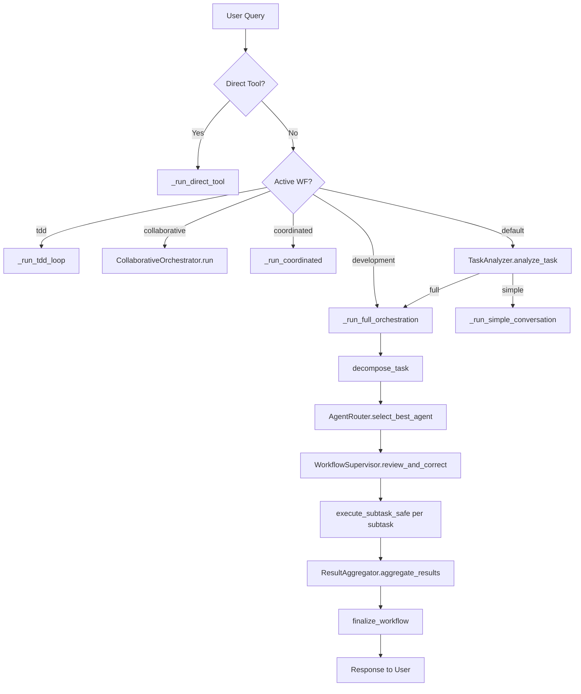

# Orchestration Layer

The `orchestration/` layer is the brain of Morphix — it analyzes tasks, decomposes them into subtasks, routes them to the best agents, supervises execution, aggregates results, and finalizes workflows.

## Module Inventory

### Analyzer (`analyzer.py`)

```python
class TaskAnalyzer:
    @staticmethod
    async def analyze_task(query: str, is_follow_up: bool = False) -> dict[str, Any]:
        # Returns: primary_type, complexity, is_direct_code_execution, requires_full_orchestration
```

Cached with a 500-entry LRU cache (TTL: 300s). Uses the LLM (role: `fast`, temperature: 0.0) to classify tasks into one of:

- `simple_conversation` — greetings, casual questions, small talk
- `creativo`, `analista`, `ejecutor`, `planificador`, `investigador`, `mixed`

The key decision is **`requires_full_orchestration`**: when `false`, the task is handled as a simple conversation (single LLM call). When `true`, the full orchestration pipeline is triggered. The `is_follow_up` flag adapts the prompt for conversation continuity — follow-ups on existing projects get reduced complexity expectations.

### Decomposer (`decomposer.py`)

```python
async def decompose_task(
    query: str,
    is_follow_up: bool = False,
    conversation_history: list[dict] | None = None,
    project_root: str | None = None,
) -> list[str]

async def decompose_task_with_phases(
    query: str,
    is_follow_up: bool = False,
    conversation_history: list[dict] | None = None,
    project_root: str | None = None,
) -> dict  # Returns: {"phases": [...], "strategy": "sequential"}
```

**`decompose_task()`** breaks a user query into 2-5 actionable subtasks. Features:

- **Project context scan**: `_build_project_context()` reads actual project files (README, main scripts) to provide real context
- **Follow-up awareness**: Injects conversation history (last 6 messages) and warns against re-creating existing files
- **Rate limiter integration**: Reduces subtask count when API rate is low
- **Safety floor**: Always returns at least 2 subtasks; caps at `settings.max_subtasks`
- **Fallback**: On LLM failure, returns a generic two-subtask split

**`decompose_task_with_phases()`** (sprint 25) produces multi-phase decompositions for the blackboard workflow. Each phase has an `order`, `description`, and `subtasks` list. Falls back to single-phase decomposition on failure.

### Router (`router.py`)

```python
class AgentRouter:
    @staticmethod
    async def select_best_agent(
        task: str,
        primary_type: str = "mixed",
        allowed_agents: list[str] | None = None,
    ) -> str
```

Cached with 500-entry LRU cache (TTL: 300s). Uses the LLM (role: `fast`, temperature: 0.0) to pick the best agent from the available list. When `allowed_agents` is provided (from workflow templates), selection is constrained to that subset. Falls back to the first available agent (or `conversacional`) if the LLM response is unrecognizable.

### Supervisor (`supervisor.py`)

```python
class WorkflowSupervisor:
    @staticmethod
    async def review_and_correct(
        task_analyzer_result: dict,
        router_selections: list[str],
        subtasks: list[str],
        allowed_agents: list[str] | None = None,
    ) -> list[str]
```

Validates and corrects agent assignments using keyword matching from agent profiles. Behavior controlled by `AUTO_FIX_LEVEL`:

| Level | Behavior |
|-------|----------|
| 0 | Skip review entirely — return router selections as-is |
| 1 | Flag mismatches in logs but return original selections |
| 2 | Auto-correct mismatched assignments |

**Analyst preservation**: The supervisor never overrides an `analista` assignment for verification subtasks (keywords: verificar, validar, revisar, probar, test, prueba, comprobar). The analyst is read-only and should not be reassigned to a code-modifying agent for verification work.

### Aggregator (`aggregator.py`)

```python
class ResultAggregator:
    @staticmethod
    async def aggregate_results(
        query: str,
        results: dict,
        G: Any,                       # networkx DiGraph
        task_analysis: dict,
        files_written: list[str] | None = None,
        project_root: str | None = None,
        workspace: str = "main",
    ) -> str
```

Synthesizes subtask results into a final response. Key behaviors:

- **Reads disk**: When `files_written` and `project_root` are provided, reads actual file contents (up to 6000 chars each) so the aggregator works with real code, not stale summaries
- **Files block**: Injects the list of actually created/modified files with strict rules against hallucination
- **Loop aggregation**: For projects with files on disk, delegates to `execute_agent_loop()` (developer agent with file_manager) for higher-quality synthesis
- **Vacuum protection**: Detects empty or useless LLM responses and falls back to a structured concatenation of subtask results

### Finalizer (`finalizer.py`)

```python
async def finalize_workflow(
    query, final_output, conversation_history, scorecard, subtasks_list,
    task_analysis, G, events, project_root=None, workspace="main",
    files_written=None, conversation_id=None,
) -> int | None  # Returns conversation_id
```

Post-execution cleanup sequence:

1. **Save conversation** — Persists user message + assistant response via `ConversationRepository.save()`; supports resuming existing conversations via `conversation_id`
2. **Save workflow** — Creates a `Workflow` record with subtasks, scorecard, status="completed"; links to the conversation
3. **Extract personal facts** — Uses LLM to extract structured user profile data from the output; updates FAISS memory
4. **Save last response** — Writes the final output (trimmed to 4000 chars) to `user_profile_last_update` memory key
5. **Smart auto-commit** — If `project_root` and `files_written` exist, triggers `smart_auto_commit()` via `core/git_operations.py`
6. **Record metrics** — Logs workflow completion to the metrics system
7. **Update live diagram** — Refreshes the Mermaid diagram if a graph is provided

### Loop (`loop.py`)

```python
@dataclass
class AgentLoopConfig:
    max_agent_iterations: int = 15    # Default from settings: 8
    max_stall_iterations: int = 2
    context_compression_threshold: float = 0.7
    context_compression_enabled: bool = True

async def execute_agent_loop(
    task: str,
    agent_type: str | None = None,
    history: list | None = None,
    allowed_tools: list | None = None,
    project_root: str | None = None,
    workspace: str = "main",
    extra_context: str = "",
    on_stream_chunk=None,
    session: Session | None = None,
    events=None,
    config: AgentLoopConfig | None = None,
) -> dict
```

The core agent execution loop implementing the **ReAct pattern** (Reason → Act → Observe → Adjust):

1. **Context enrichment**: CodebaseIndexer finds relevant code + FAISS memory searches for similar past tasks
2. **Skill/kits injection**: Loads tool skills and kits YAMLs into system prompt
3. **Function-calling**: Builds tool definitions from `TOOL_DEFINITIONS`, uses native function-calling API
4. **Streaming accumulation**: `_accumulate_stream()` handles interleaved text + tool_call chunks
5. **Stall detection**: Tracks consecutive non-modifying iterations; max 2 stalls trigger early exit
6. **Clarification interception**: `ask_clarification` calls pause the loop and return state for user interaction
7. **Repeat tracking**: Detects the same non-modifying tool+args 3+ times as a stall
8. **Context compression**: At 70% token budget, compresses history and filters orphaned tool messages

Returns a dict with `status`, `result`, `actions_taken`, `iterations`, and `files_written`.

### Runner (`runner.py`)

```python
class WorkflowRunner:
    def __init__(self, session)
    async with_timeout(coro, timeout_seconds, *, phase, fallback="") -> WorkflowResult
    async safe_call(coro, *, fallback=None, error_tag="") -> T | None
    def check_cancelled() -> None
    def elapsed() -> float
    def phase_stats() -> dict[str, float]

class WorkflowTimeoutError(asyncio.TimeoutError)
class WorkflowCancelledError(asyncio.CancelledError)
class CircuitBreakerOpenError(Exception)
```

Wraps a `Session` to provide timeout, cancellation, and safe execution for each workflow phase. Returns standardized `WorkflowResult` objects (success, failure, or timeout). Tracks per-phase timing.

### Context (`context.py`)

```python
@dataclass
class WorkflowContext:
    query: str, mode: str, conversation_history: list, current_pdf_text: str,
    workspace: str, project_root: str | None, active_workflow: str,
    force_agent: str | None, allowed_tools: list | None, settings, agents_registry,
    enc, conversation_id: int | None, is_follow_up: bool, cancelled: bool,
    last_clarification: str, blackboard

@dataclass
class WorkflowEvents:
    on_system_message, on_assistant_message, on_user_message, on_stream_chunk,
    on_diagram_update, on_stats_update, on_ui_refresh, on_approval_required,
    on_agent_message: all Callable | None

@dataclass
class Session:
    context: WorkflowContext
    events: WorkflowEvents
    def cancel(), is_cancelled: bool
```

UI-free abstractions that decouple orchestration logic from any specific UI framework. `WorkflowEvents` is a set of async callbacks the orchestrator calls; the UI layer implements them (PySide6 signals or CLI print). `Session` bundles context and events for cleaner function signatures.

**Emit helpers**: `emit_system()`, `emit_assistant()`, `emit_user()`, `emit_stream_chunk()`, `emit_diagram()`, `emit_stats()`, `emit_refresh()`, `emit_agent()` — all use `_emit()` which silently catches callback exceptions.

### Events (`events.py`)

Re-exports from `orchestration/context.py` for backward compatibility. New code should import from `orchestration.context`.

### Diagram (`diagram.py`)

Generates Mermaid diagrams from the workflow graph (`networkx.DiGraph`). Writes snapshots to disk off the event loop thread to avoid blocking.

### Loader (`loader.py`)

```python
def load_workflow_template(workspace_name: str, template_name: str) -> dict
```

Loads a workflow template YAML. Checks `workspaces/<name>/workflows/` first (workspace override), falling back to `templates/workflows/`. On first workspace switch, templates are copied from `templates/workflows/` to the workspace directory.

### Result Types (`result_types.py`)

```python
@dataclass
class WorkflowResult:
    success: bool, content: str, error: str | None, timeout: bool,
    metadata: dict[str, Any]

def success(content, **metadata) -> WorkflowResult
def failure(error, partial_content="", **metadata) -> WorkflowResult
def timeout(partial_content="", timeout_seconds=0) -> WorkflowResult
```

### Status (`status.py`)  ·  Utils (`utils.py`)

- **Status**: Workflow status tracking throughout the execution lifecycle
- **Utils**: `generate_scorecard()` — produces structured scorecard dicts from subtask results, timings, and token usage

## Executor Submodules (`executor/`)

| Module | Purpose |
|--------|---------|
| `plan.py` | `_execute_plan_actions()` — Parses and executes plan-mode actions from the LLM |
| `subtask.py` | `execute_subtask_safe()` — Safe subtask execution with error handling and progress tracking |
| `verify.py` | `_extract_and_validate_actions()` — Extracts and validates actions from LLM output |
| `post.py` | Post-subtask processing and cleanup |

## Workflow Strategies (`workflows/`)

### Orchestrator (`orchestrator.py`)

The central dispatcher: `WorkflowOrchestrator.run_full_workflow(session: Session) -> str | None`.

**6-route dispatch** (evaluated in precedence order):

```python
@staticmethod
async def run_full_workflow(session: Session) -> str | None:
```

| Priority | Route | Trigger | Handler |
|----------|-------|---------|---------|
| 1 | **Direct tool** | Query matches `tool_name: action, key=val` pattern | `_run_direct_tool()` |
| 2 | **TDD loop** | Active workflow == `"tdd"` | `_run_tdd_loop()` |
| 3 | **Collaborative** | Template `type` == `"collaborative"` | `CollaborativeOrchestrator.run()` |
| 4 | **Coordinated** | Template `type` == `"coordinated"` | `_run_coordinated()` |
| 5 | **Development** | Template `type` == `"development"` | `_run_full_orchestration()` (skips TaskAnalyzer) |
| 6 | **Default** | Fallback | `TaskAnalyzer.analyze_task()` → `_run_simple_conversation()` or `_run_full_orchestration()` |

**Direct tool detection** (`_parse_direct_tool_command`): Validates the tool name exists in the registry before matching, preventing false positives on natural language like "navega y analiza : URL".

**Paused session handling**: Clarification requests pause the workflow — state is persisted to `PausedSession` and survives app restarts. On resume, the previous answer is injected and execution continues from the pause point.

### Collaborative (`collaborative.py`)

Multi-agent panel debate with iterative rounds:

```python
class CollaborativeOrchestrator:
    @staticmethod
    async def run(query, template, events, history, project_root, workspace,
                  force_agent, workflow_allowed_tools, start_time) -> str
```

- **Panel**: Agent list from `template.panel` (min 2 agents)
- **Rounds**: Configurable (default 3), each round all panelists respond, then moderator synthesizes
- **Timeout**: 120s per round
- **Moderator**: From `template.moderator` (default: `moderador`); identifies agreement/disagreement, guides toward consensus
- **Force agent**: A specific agent can be injected as leader via `force_agent`
- **Context sharing**: All panelists receive prior round outputs

### Coordinated (`coordinated.py`)

DAG-based parallel execution:

```python
class MultiAgentCoordinator:
    async def decompose_task_dag(query) -> dict       # Phase 1: DAG decomposition
    async def assign_agents(task, subtask) -> str     # Phase 2: LLM-based routing
    async def execute_dag(dag, ...) -> dict           # Phase 3: Parallel execution
    async def aggregate_with_confidence(...) -> str   # Phase 4: Weighted synthesis
```

- **DAG decomposition**: LLM produces structured JSON with subtask `id`, `depends_on`, and `agent_hint` fields
- **max_parallel**: 4 concurrent subtasks
- **Timeout**: 180s per subtask
- **Agent hints**: Each subtask includes an `agent_hint` field that feeds into `AgentRouter`
- **Shared blackboard**: `SharedBlackboard` for cross-agent context sharing
- **Confidence-weighted aggregation**: Phase 4 uses `aggregate_with_confidence()` for quality-weighted synthesis

### TDD (`tdd.py`)

Test-driven development loop:

```python
async def execute_tdd_loop(
    task, workspace="main", project_root=None, allowed_tools=None,
    agent_type=None, conversation_history=None,
    max_iterations=MAX_TDD_ITERATIONS,  # 5
) -> dict
```

- **Green-field detection**: `_project_has_no_tests()` scans for `test_*.py` / `*_test.py` in the project directory
- **Pytest execution**: Runs `pytest --rootdir=<project> -p no:cacheprovider`; skips `.git`, `node_modules`, `__pycache__`, `.venv`
- **Max iterations**: 5 (configurable)
- **Timeout**: 300s per iteration
- **Loop**: Run tests → if failures, invoke agent with failure context → agent fixes code → repeat until all pass or limit reached

### Blackboard (`blackboard.py`)

Multi-phase shared workspace for inter-agent communication:

```python
class SharedBlackboard:
    async def write(key, value, phase="default")
    async def read(key, phase=None)  # phase=None searches all phases
    async def read_phase(phase) -> dict
    def snapshot() -> dict
    def restore(snapshot: dict)
    def get_cross_phase_context(exclude_phase=None) -> str
    async def sync_to_db(session_id)  # PostgreSQL persistence
```

- **Phase-scoped namespaces**: Each write is scoped to a phase; reads can search all phases
- **Async-safe**: Uses `asyncio.Lock` for concurrent access
- **Snapshot/restore**: For pause/resume scenarios
- **Persistence**: `sync_to_db()` stores to PostgreSQL for crash recovery

## Full Orchestration Pipeline



Key safety guards throughout the pipeline:

- **Circuit breaker**: On both `call` and `call_stream` LLM methods
- **Timeouts**: Every phase wrapped with `WorkflowRunner.with_timeout()`
- **Cancellation**: `WorkflowRunner.check_cancelled()` at each phase boundary
- **Stall detection**: Agent loop exits after 2 consecutive non-modifying iterations
- **Rate limiter**: Decomposer adapts subtask count when API rate is low
