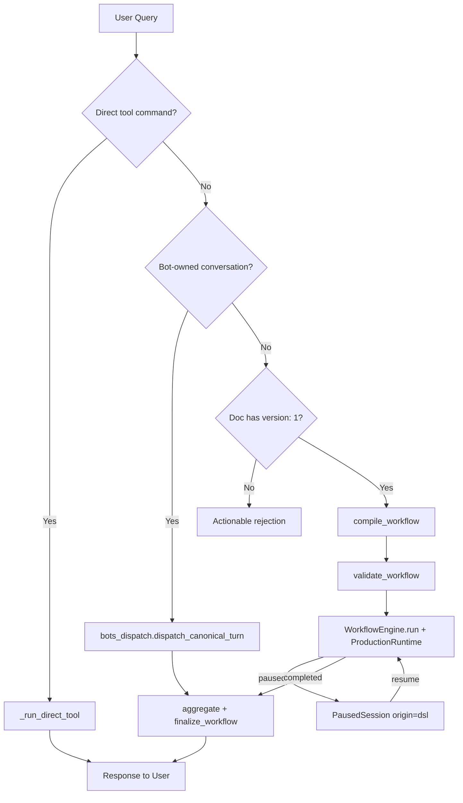

# Orchestration Layer

The `orchestration/` layer is the brain of Morphix — it routes each request to the right execution path, runs the deterministic workflow DSL engine, executes agent loops (ReAct), decomposes tasks, aggregates results, and finalizes workflows.

The legacy orchestration system (TaskAnalyzer/AgentRouter/Supervisor, the per-type workflow strategies and the `executor/` submodules) was **retired**: the only workflow format is the DSL (`version: 1` YAML). `run_full_workflow()` has exactly three execution routes plus resume handling for persisted pauses.

## Module Inventory

### Orchestrator (`workflows/orchestrator.py`)

The central router: `WorkflowOrchestrator.run_full_workflow(session: Session) -> str | None`. It detects the route and delegates execution — it does not implement workflow logic itself.

**3-route dispatch** (evaluated in precedence order):

| Priority | Route | Trigger | Handler |
|----------|-------|---------|---------|
| 1 | **Direct tool** (fast path) | Query matches `tool_name: action, key=val` pattern and the tool exists in the registry | `_run_direct_tool()` |
| 2 | **Bot canonical chat** | The conversation is owned by a bot (`canonical_owner_of`) | `bots_dispatch.dispatch_canonical_turn()` |
| 3 | **DSL engine** | The active workflow document has `version: 1` | `_run_dsl_workflow()` (compile → validate → engine) |

A document without `version: 1` is rejected with an actionable error (the legacy format no longer exists — the message points to `python -m orchestration.dsl.cli new`). A missing document fails with a hint to create one.

**Direct tool detection** (`_parse_direct_tool_command`): validates the tool name exists in the registry before matching, preventing false positives on natural language like "navega y analiza : URL".

**Paused session handling**: clarification requests and DSL checkpoints pause the workflow — state is persisted to `PausedSession` and survives app restarts. On resume (`resume_workflow()`), the stored `origin` selects the path: `origin="dsl"` → `_resume_dsl()` re-injects the human answer at the exact paused step (checkpoint approval or `clarify_answers` for `decide`); `origin="bot"` → `bots_dispatch.resume_bot_turn()`. Pauses from retired legacy origins answer that they are not resumable.

### DSL Engine (`dsl/`)

The deterministic workflow engine. Design rule: **"el modelo elige, el motor acota"** — flow control NEVER depends on free-form LLM output; every model decision is validated against a declared contract with a deterministic fallback.

| Module | Purpose |
|--------|---------|
| `schema.py` | `WorkflowDSL` pydantic model — discriminated union of 10 step kinds, `extra="forbid"` at every level, recursive unique-id check |
| `compiler.py` | YAML → `CompiledWorkflow` IR. `FileSystemCatalog` resolves presets: workspace-local → `templates/workspaces/<ws>/` → global `templates/workflows/`. Includes with cycle detection and depth ≤ 3 |
| `validator.py` | Deterministic semantic validation: agent allowlists, `$var` references, `depends_on`, I/O contract of `workflow` includes |
| `engine.py` | `WorkflowEngine` interpreter: retry, `when` gates, loops (over/until), parallel branches by levels, checkpoint pauses with full snapshot |
| `registry.py` + `plugins.py` | Plugin primitives (`kind: plugin`) — runtime semantics without touching the engine |
| `runtime_adapter.py` | `ProductionRuntime` — the `EngineRuntime` implementation that bridges the engine to real agents, tools and LLM |
| `conformance.py` | `simulate_preset()` + `ConformanceReport` — executes presets against the real engine with fake-but-signature-identical handlers |
| `cli.py` | `poetry run python -m orchestration.dsl.cli new/validate/list` (`validate --conformance` also runs the simulation) |

#### Step kinds (10)

| Kind | Purpose |
|------|---------|
| `agent` | Run an agent with a goal; optional `retry_max`, `timeout`, `model_role`, output vars |
| `tool` | Call a tool with `args`; `outputs` maps state vars to result keys |
| `decompose` | Task decomposition (`strategy: flat \| dag`) into a list variable |
| `parallel` | Branches with optional `depends_on`, `max_parallel` (default 2, ≤ 8) |
| `loop` | `max_iter` (1–20), `over` a list var (`$item`), `until` early exit, `init_vars`, optional `parallel` body per item |
| `decide` | Bounded non-determinism: the model picks from an `options` enum; invalid/ambiguous output → declared `fallback` branch |
| `checkpoint` | Human pause persisted as `PausedSession` before continuing |
| `workflow` | Include another preset as a subroutine with explicit I/O contract (`inputs`/`outputs`) |
| `aggregate` | Final synthesis: `strategy: result \| confidence \| moderator` |
| `plugin` | Registered plugin primitive with its own validated `params` |

#### Gating and bounded non-determinism

- **`when` conditions** gate any step: `if_blockers` (blocking pattern in `$last_gate`), `query_contains:X`, or a truthy `$var`.
- **Agent gates**: an `agent` step may declare `gate: true` (standard blocking pattern) or a regex — the compiled match sets `$last_gate` for downstream `when: if_blockers`.
- **`until` loop exits** (discriminated union):
  - `type: tool` — a tool result key must be truthy (e.g. `check: tests_all_pass`); `args` are interpolated with state `$var`s.
  - `type: metric` — numeric comparison (`op`, `value`) over a structured tool result.
  - `type: agent` — the model answers within an `expect` enum; invalid output applies the deterministic `fallback` (`fail` or `exit`).
- **Variable interpolation**: `$var` references are resolved by the engine; an undefined variable fails loud (`EngineError`) instead of silently continuing. `$iter`/`$max_iter` are exposed inside sequential loops.
- **`commit_after`**: the engine commits via git only after phases declared in the doc, and only when the phase completed with files written.
- **`skills: true`**: enables procedural skills injection for agent calls in the workflow.

#### Pauses and resume

A `checkpoint` (or a `decide` needing clarification) raises a typed pause inside the engine. `WorkflowEngine.run()` returns `status="paused"` with a **full snapshot**: `vars`, `completed` steps, `loop_state`, `children`, plus `paused_step`/`paused_kind` (qualified path `ciclo#N/id`). The orchestrator persists it as `PausedSession origin="dsl"`. `_resume_dsl()` rebuilds the engine state from the snapshot and injects the human answer at the exact step. Without a `conversation_id` (headless), pausing fails with a clear message.

#### Runtime adapter (`ProductionRuntime`)

Implements the `EngineRuntime` port (the engine never imports LLM/tools directly): `call_agent` (streams chunks via `agent_stream`/`agent_status` events), `call_tool` (applies the same context-kwarg injection as the agent loop — only parameters the handler accepts), `decompose`, `decide`, `evaluate`, `checkpoint`, `aggregate`, `commit_after_step`, `emit`. Tool outputs from external content are wrapped in untrusted-data markers.

### Bots Dispatch (`bots_dispatch.py`, `bots_runner.py`)

- **`bots_dispatch.dispatch_canonical_turn()`** — body of the canonical-chat guard: runs the turn via `bots_runner`, persists via the canonical path, handles `origin="bot"` pauses with scorecard `bot_canonical_chat`. Also `resume_bot_turn()` and `annotate_query_mentions()` (identification-only mention middleware).
- **`bots_runner.run_bot_turn(slug, query, conv_id, transport=...)`** — the single execution point for bot turns. Never touches the orchestrator or workflow templates: it runs `execute_agent_loop()` with the bot's toolset, model override, skills allowlist and SOUL/memory/protocol layers.
- **`bots_wake.py` / `bots_clock.py` / `bots_groups_drive.py`** — the three daemon transports (DM delivery from `pending_turns`, routine scheduler, group rooms).

### Pauses (`pauses.py`)

`save_paused_session()` / `warn_pause_not_persisted()` — shared by the bot and DSL routes. A pause that fails to persist emits a visible system warning instead of being lost silently.

### Decomposer (`decomposer.py`)

```python
async def decompose_task(
    query: str,
    is_follow_up: bool = False,
    conversation_history: list[dict] | None = None,
    project_root: str | None = None,
) -> list[str]

async def decompose_task_with_phases(
    query: str,
    is_follow_up: bool = False,
    conversation_history: list[dict] | None = None,
    project_root: str | None = None,
) -> dict  # Returns: {"phases": [...], "strategy": "sequential"}
```

**`decompose_task()`** breaks a user query into 2-5 actionable subtasks. Features:

- **Project context scan**: `_build_project_context()` reads actual project files (README, main scripts) to provide real context
- **Follow-up awareness**: Injects conversation history (last 6 messages) and warns against re-creating existing files
- **Rate limiter integration**: Reduces subtask count when API rate is low
- **Safety floor**: Always returns at least 2 subtasks; caps at `settings.max_subtasks`
- **Fallback**: On LLM failure, returns a generic two-subtask split

**`decompose_task_with_phases()`** produces multi-phase decompositions. Each phase has an `order`, `description`, and `subtasks` list. Falls back to single-phase decomposition on failure.

### Aggregator (`aggregator.py`)

```python
class ResultAggregator:
    async def aggregate_results(
        query: str,
        results: dict,
        G: Any,                       # networkx DiGraph
        task_analysis: dict,
        files_written: list[str] | None = None,
        project_root: str | None = None,
        workspace: str = "main",
    ) -> str
```

Single aggregation path for DSL finalization and multi-subtask flows. Key behaviors:

- **Deterministic evaluation**: programmatic success/partial/failure per subtask (status and files written), not prompt-engineered verdicts
- **Reads disk**: when `files_written` and `project_root` are provided, reads actual file contents (up to 6000 chars each) so aggregation works with real code, not stale summaries
- **Files block**: injects the list of actually created/modified files with strict rules against hallucination
- **Conformance check**: detects requested structures (loop/function/class) that were never implemented and downgrades success to partial
- **Vacuum protection**: detects empty or useless LLM responses and falls back to a structured concatenation of subtask results

### Finalizer (`finalizer.py`)

```python
async def finalize_workflow(...) -> int | None  # Returns conversation_id
```

Post-execution persistence sequence:

1. **Save conversation** — Persists user message + assistant response via `ConversationRepository.save()`; supports resuming existing conversations via `conversation_id`
2. **Save workflow** — Creates a `Workflow` record with subtasks, scorecard, status; links to the conversation
3. **Extract personal facts** — Uses LLM to extract structured user profile data; updates FAISS memory (trivial profiles are rejected)
4. **Save last response** — Writes the final output (trimmed) to `user_profile_last_update` memory key
5. **Record metrics** — Logs workflow completion to the metrics system

### Loop (`loop.py`)

```python
@dataclass
class AgentLoopConfig:
    max_agent_iterations: int = 15    # Default from settings: 8
    max_stall_iterations: int = 2
    context_compression_threshold: float = 0.7
    context_compression_enabled: bool = True

async def execute_agent_loop(
    task: str,
    agent_type: str | None = None,
    history: list | None = None,
    allowed_tools: list | None = None,
    project_root: str | None = None,
    workspace: str = "main",
    extra_context: str = "",
    on_stream_chunk=None,
    session: Session | None = None,
    events=None,
    config: AgentLoopConfig | None = None,
) -> dict
```

The core agent execution loop implementing the **ReAct pattern** (Reason → Act → Observe → Adjust):

1. **Context enrichment**: CodebaseIndexer finds relevant code + FAISS memory searches for similar past tasks
2. **Skill/kits injection**: Loads tool skills, kits and procedural skills YAMLs into system prompt
3. **Function-calling**: Builds tool definitions from `TOOL_DEFINITIONS`, uses native function-calling API
4. **Streaming accumulation**: `_accumulate_stream()` handles interleaved text + tool_call chunks (orphan argument buffering included)
5. **Stall detection**: Tracks consecutive non-modifying iterations; max 2 stalls trigger early exit
6. **Clarification interception**: `ask_clarification` calls pause the loop and return state for user interaction (denied inside routines/DM transports via `clarification_denied`)
7. **Repeat tracking**: Detects the same non-modifying tool+args 3+ times as a stall
8. **Context compression**: At 70% token budget, compresses history and filters orphaned tool messages
9. **Partial stats**: `_agent_loop_stats()` emits live token usage and a non-terminal final status so UI activity indicators stay honest

Returns a dict with `status`, `result`, `actions_taken`, `iterations`, and `files_written`.

### Context (`context.py`)

```python
@dataclass
class WorkflowContext:
    query: str, mode: str, conversation_history: list, current_pdf_text: str,
    workspace: str, project_root: str | None, active_workflow: str,
    force_agent: str | None, allowed_tools: list | None, policy, settings,
    agents_registry, enc, conversation_id: int | None, is_follow_up: bool,
    cancelled: bool, last_clarification: str, blackboard, skills_enabled: bool

@dataclass
class WorkflowEvents:
    on_system_message, on_assistant_message, on_user_message, on_stream_chunk,
    on_stats_update, on_ui_refresh, on_approval_required,
    on_agent_message, on_agent_stream, on_agent_status: all Callable | None

@dataclass
class Session:
    context: WorkflowContext
    events: WorkflowEvents
    emitter: WorkflowEmitter | None
    def cancel(), is_cancelled: bool
```

UI-free abstractions that decouple orchestration logic from any specific UI framework. `WorkflowEvents` is a set of async callbacks the orchestrator calls; the UI layer implements them (PySide6 signals or CLI print). `Session` bundles context, events and the normalized `WorkflowEmitter` for cleaner function signatures.

**Emit helpers**: `emit_system()`, `emit_assistant()`, `emit_user()`, `emit_stream_chunk()`, `emit_stats()`, `emit_refresh()`, `emit_agent()`, `emit_agent_stream()`, `emit_agent_status()` — all silently catch callback exceptions. The UI derives the phase diagram locally from each `stats_update`.

### Emitter (`emitter.py`)

`WorkflowEmitter` — the normalized stats contract every execution path emits: `status`, `current_agent`, `subtask_list`, `subtasks_total`, `subtasks_completed`, `files_written` (always a list), `phase`, `iterations`, `actions_taken`. Partial updates emit the full validated state; unknown fields warn instead of crashing the run. The emitter lives on the `Session` so `elapsed_time`/token totals survive clarification pauses.

### Loader (`loader.py`)

```python
def load_workflow_document(workspace_name: str, template_name: str) -> dict | None
def list_workflows(workspace_name: str | None = None) -> list[str]
def expand_dsl_project_root(root: str | None) -> str | None
```

Reads the raw workflow YAML (workspace override first, then product templates, then global `templates/workflows/`). Returns the raw document — DSL dispatch checks `version: 1` on it. `expand_dsl_project_root()` resolves `${VAR}`, `${VAR:-default}` and `~` in `project.root`; it is wired into the DSL run path so every consumer receives a resolved path.

### Status (`status.py`)  ·  Utils (`utils.py`)

- **Status**: phase-card rendering helpers — derives the workflow phase diagram locally from `subtask_list` stats payloads (`render_from_subtasks`)
- **Utils**: `generate_scorecard()` — produces structured scorecard dicts from subtask results, timings, and token usage

### Template schema (`template_schema.py`)

Conserves only `AgentsConfig`, `ToolsConfig` and `ProjectConfig` — the deny-by-default configs the DSL schema reuses. The legacy `WorkflowTemplate`/`StageSpec` models were removed with the legacy routes.

## Execution Flow


```mermaid
graph TD
    A[User Query] --> B{Direct tool command?}
    B -->|Yes| C[_run_direct_tool]
    B -->|No| D{Bot-owned conversation?}
    D -->|Yes| E[bots_dispatch.dispatch_canonical_turn]
    D -->|No| F{Doc has version: 1?}
    F -->|No| X[Actionable rejection]
    F -->|Yes| G[compile_workflow]
    G --> H[validate_workflow]
    H --> I[WorkflowEngine.run + ProductionRuntime]
    I -->|paused| J[PausedSession origin=dsl]
    I -->|completed| K[aggregate + finalize_workflow]
    J -->|resume| I
    E --> K
    C --> L[Response to User]
    K --> L
```

Key safety guards throughout the pipeline:

- **Bounded non-determinism**: `decide` (enum + fallback) and `until.agent` (`expect` + fallback) — the flow control never trusts free-form LLM output
- **Circuit breaker**: On both `call` and `call_stream` LLM methods
- **Timeouts**: per-step `timeout` in the DSL; `safe_tool_call` default timeout for tools
- **Cancellation**: `Session.cancel()` checked at phase boundaries; `⏹` stop persists the partial conversation
- **Stall detection**: Agent loop exits after 2 consecutive non-modifying iterations
- **Conformance suite**: every product preset is executed against the real engine in `tests/test_dsl_conformance.py` and via `cli validate <preset> --conformance` — structural validation alone is not enough
