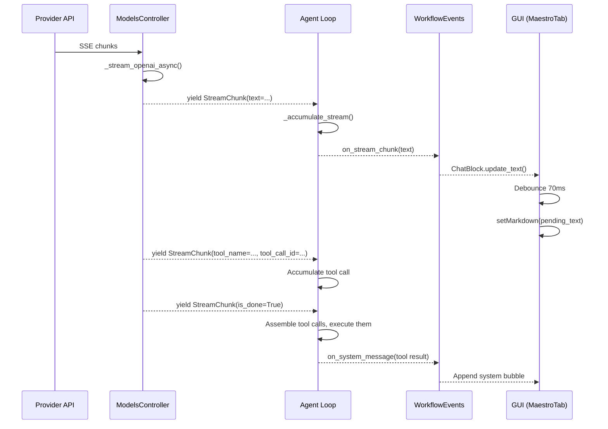

# Streaming Architecture

Morphix uses **OpenAI-compatible SSE (Server-Sent Events)** for real-time LLM response streaming. Text and tool-call deltas flow from the LLM provider through the controller and accumulator to the GUI, where they are rendered with batched updates.

## Streaming Provider Support

| Provider | Protocol | Client |
|----------|----------|--------|
| DeepSeek | SSE (OpenAI-compatible) | `AsyncOpenAI` SDK |
| OpenAI | SSE | `AsyncOpenAI` SDK |
| Grok | SSE (OpenAI-compatible) | `AsyncOpenAI` SDK |
| Ollama | Custom stream (sync thread → async queue) | `ollama` Python client |

All OpenAI-compatible providers use the same code path in `_stream_openai_async()`. Ollama uses a separate `_stream_ollama()` implementation that bridges a synchronous blocking thread to the async event loop via a `queue.Queue`.

## Entry Point: `call_stream()`

```python
# llm/controller.py:247-336
async def call_stream(
    self, messages, role="default", temperature=None, tools=None, tool_choice="auto", **kwargs
) -> AsyncGenerator[StreamChunk, None]:
```

Before streaming starts, two checks run:

1. **Circuit breaker**: If the provider's circuit breaker is OPEN (too many failures), the stream is blocked immediately and an error chunk is yielded.
2. **Token budget**: If the message history exceeds 90% of `MAX_CONTEXT_TOKENS`, history is compressed to 70% before streaming.

On failure, the stream retries up to `llm_max_retries` times with exponential backoff. If all retries fail, it falls back to a non-streaming call:

```python
# llm/controller.py:317-336 — fallback
response = await self.call(
    messages=messages, role=role, temperature=temperature,
    tools=tools, tool_choice=tool_choice, **kwargs,
)
text = response.choices[0].message.content if response.choices else ""
yield StreamChunk(text=text or "", is_done=True)
```

## OpenAI-Compatible Streaming: `_stream_openai_async()`

```python
# llm/controller.py:338-419
async def _stream_openai_async(self, client, model, messages, temp, tools, tool_choice, **kwargs):
    call_kwargs = {
        "model": model,
        "messages": messages,
        "temperature": temp,
        "stream": True,
        "stream_options": {"include_usage": True},  # DeepSeek/OpenAI usage in final chunk
    }
    if tools:
        call_kwargs["tools"] = tools
        call_kwargs["tool_choice"] = tool_choice

    response = await client.chat.completions.create(**call_kwargs)
```

Each SSE chunk is processed as an async iteration over `response`:

```python
async for chunk in response:
    delta = chunk.choices[0].delta if chunk.choices else None
    finish = chunk.choices[0].finish_reason if chunk.choices else None
```

### Chunk Types

| Chunk Content | Yields |
|---------------|--------|
| `delta.content` (text) | `StreamChunk(text=delta.content)` |
| `delta.reasoning_content` | `StreamChunk(reasoning_content=...)` |
| `delta.tool_calls[*]` with name | `StreamChunk(tool_name=..., tool_call_id=...)` |
| `delta.tool_calls[*]` with arguments | `StreamChunk(tool_arguments=..., tool_call_id=...)` |
| `finish_reason` present | `StreamChunk(finish_reason=..., usage=..., is_done=True)` |

## Tool-Call Argument Accumulation (Critical Detail)

!!! warning "Sprint 25b Bug Fix"
    The OpenAI SSE protocol sends tool-call deltas where **only the first delta carries `id` and `name`**. Subsequent deltas have `id=None` and only `function.arguments` fragments. Accumulating by `id` alone would drop argument fragments on subsequent chunks.

The fix uses the delta's stable **`index`** field as the primary key:

```python
# llm/controller.py:394-419
if delta.tool_calls:
    for tc in delta.tool_calls:
        idx = getattr(tc, "index", None)
        tc_id = getattr(tc, "id", None)
        key = idx if idx is not None else tc_id  # Prefer index
        if key is None:
            continue
        if key not in tool_acc:
            tool_acc[key] = {
                "id": tc_id or f"call_{len(tool_acc)}",
                "name": "",
                "arguments": "",
            }
        entry = tool_acc[key]
        if tc_id:
            entry["id"] = tc_id  # Update real ID when it arrives
        func = getattr(tc, "function", None)
        if func:
            if getattr(func, "name", None):
                entry["name"] = func.name
                yield StreamChunk(tool_name=func.name, tool_call_id=entry["id"])
            if getattr(func, "arguments", None):
                entry["arguments"] += func.arguments
                yield StreamChunk(
                    tool_arguments=func.arguments, tool_call_id=entry["id"]
                )
```

!!! tip "Key insight"
    Every chunk with `tool_arguments` re-emits the **real** `tool_call_id` (not the temporary one), so the downstream accumulator can correctly concatenate all argument fragments under a single ID.

### Example: A Complete Tool Call via 3 Chunks

```
Chunk 1: index=0, id="call_abc", function.name="file_manager"
  → StreamChunk(tool_name="file_manager", tool_call_id="call_abc")
Chunk 2: index=0, id=None, function.arguments='{"action":'
  → StreamChunk(tool_arguments='{"action":', tool_call_id="call_abc")
Chunk 3: index=0, id=None, function.arguments='"write"}'
  → StreamChunk(tool_arguments='"write"}', tool_call_id="call_abc")
```

The accumulator receives 3 chunks, all with `tool_call_id="call_abc"`, and concatenates the arguments into `{"action": "write"}`.

## Stream Accumulator: `_accumulate_stream()`

```python
# orchestration/loop.py:62-132
async def _accumulate_stream(stream, on_chunk) -> tuple[str, list[dict], str | None, str]:
```

This function consumes the `StreamChunk` generator and produces the final assembled response. It handles:

### Text Accumulation

```python
if chunk.text:
    full_text += chunk.text
    if on_chunk:
        await on_chunk(chunk.text)  # Forward to GUI
```

### Reasoning Content

```python
if chunk.reasoning_content:
    reasoning += chunk.reasoning_content
```

### Tool Call Assembly

The accumulator mirrors the controller's tool-call tracking but uses `tool_call_id` as the key (since the controller already normalized by index):

```python
# Tool name arrives (may come before or after arguments)
if chunk.tool_name and chunk.tool_call_id:
    tid = chunk.tool_call_id
    if tid not in tool_call_by_id:
        tool_call_by_id[tid] = {
            "id": tid,
            "function": {"name": chunk.tool_name, "arguments": ""},
        }
    else:
        tool_call_by_id[tid]["function"]["name"] = chunk.tool_name

# Tool arguments arrive
if chunk.tool_arguments and chunk.tool_call_id:
    tid = chunk.tool_call_id
    if tid not in tool_call_by_id:
        if chunk.tool_name:
            # Name available — create entry
            tool_call_by_id[tid] = {
                "id": tid, "function": {"name": chunk.tool_name, "arguments": ""},
            }
        else:
            continue  # Defer — wait for name
    tool_call_by_id[tid]["function"]["arguments"] += chunk.tool_arguments
```

### Usage Tracking on Completion

When `is_done=True`, usage metrics are recorded:

```python
if chunk.is_done:
    finish_reason = chunk.finish_reason
    if chunk.usage:
        metrics.record_llm_usage(
            prompt_tokens=chunk.usage.get("prompt_tokens", 0),
            completion_tokens=chunk.usage.get("completion_tokens", 0),
            cache_hit_tokens=chunk.usage.get("prompt_cache_hit_tokens", 0),
            cache_miss_tokens=chunk.usage.get("prompt_cache_miss_tokens", 0),
        )
        cache_manager.track_usage(...)
```

### Return Value

```python
tool_calls = list(tool_call_by_id.values()) if tool_call_by_id else []
return full_text, tool_calls, finish_reason, reasoning
```

## Ollama Streaming: `_stream_ollama()`

Ollama's Python client is **synchronous and blocking**. To stream without blocking the async event loop, a background thread pushes chunks into a `queue.Queue`, and the async generator polls the queue:

```python
# llm/controller.py:421-450
def _produce_chunks():
    try:
        response = client.chat(model=model, messages=messages, stream=True, ...)
        for chunk in response:
            chunk_queue.put(chunk)
    except Exception:
        logger.exception("Error en streaming Ollama")
    finally:
        chunk_queue.put(None)  # Sentinel

import threading
thread = threading.Thread(target=_produce_chunks, daemon=True)
thread.start()

while True:
    try:
        chunk = await asyncio.get_event_loop().run_in_executor(
            None, chunk_queue.get, True, 0.1
        )
    except queue.Empty:
        continue
    if chunk is None:
        break  # End of stream
    # Process chunk...
```

## GUI Debounce: Preventing O(n²) Re-renders

`QTextBrowser.setMarkdown()` re-parses and re-lays-out the entire document on every call. If called on every streaming token (which can arrive at 50+ tokens/second for fast models), rendering cost grows quadratically with content length.

The solution is a **70ms debounce timer** in `ChatBlock`:

```python
# desktop/widgets/chat_bubble.py:157-184
def update_text(self, text: str):
    """Coalesce updates: render at most once per ~70ms."""
    self._text = text
    self._pending_text = text
    if self._stream_timer is None:
        self._stream_timer = QTimer(self)
        self._stream_timer.setSingleShot(True)
        self._stream_timer.timeout.connect(self._flush_stream)
    if not self._stream_timer.isActive():
        self._stream_timer.start(70)

def _flush_stream(self):
    if self._pending_text is None or self._browser is None:
        return
    self._browser.setMarkdown(self._pending_text)
    self._pending_text = None
    self._update_text_width()

def flush_stream(self):
    """Render any pending text immediately (e.g. at stream end)."""
    if self._stream_timer is not None and self._stream_timer.isActive():
        self._stream_timer.stop()
    self._flush_stream()
```

At stream end, `flush_stream()` is called to render final content immediately without waiting for the timer.

## Performance Impact

| Approach | Tokens/sec rendered | CPU impact |
|----------|---------------------|------------|
| No debounce (every token) | ~5 | Very high (O(n²) re-layouts) |
| 70ms debounce | ~60+ | Low (batched renders) |

The debounce makes streaming feel smooth and responsive even for long responses (1000+ tokens). The 70ms interval is below human perception threshold for text rendering, so users perceive continuous streaming.

## Non-Streaming Path (for Comparison)

The non-streaming `call()` method uses the OpenAI SDK's non-streaming endpoint:

```python
# llm/controller.py:184
response = client.chat.completions.create(**call_kwargs)
# Returns complete response — no chunk processing needed
```

Tool calls are already fully assembled by the SDK:

```python
# response.choices[0].message.tool_calls is a list of complete tool calls
```

This path is simpler but provides no progressive feedback. It's used as a **fallback** when streaming fails, and for internal LLM calls where streaming adds no value (e.g., `TaskAnalyzer` classification).

## Notification Flow: StreamChunk to GUI Callback



## Streaming Summary

| Component | Role |
|-----------|------|
| `ModelsController.call_stream()` | Entry point: retries, circuit breaker, token budget |
| `_stream_openai_async()` | SSE chunk → `StreamChunk` yield loop (OpenAI-compatible) |
| `_stream_ollama()` | Sync thread → async queue bridge |
| `_accumulate_stream()` | Chunk consumer: text concat, tool-call assembly, usage tracking |
| `ChatBlock.update_text()` | GUI: 70ms debounced markdown rendering |
| `StreamChunk` | Unified dataclass: text, tool_name, tool_arguments, tool_call_id, finish_reason, usage |
