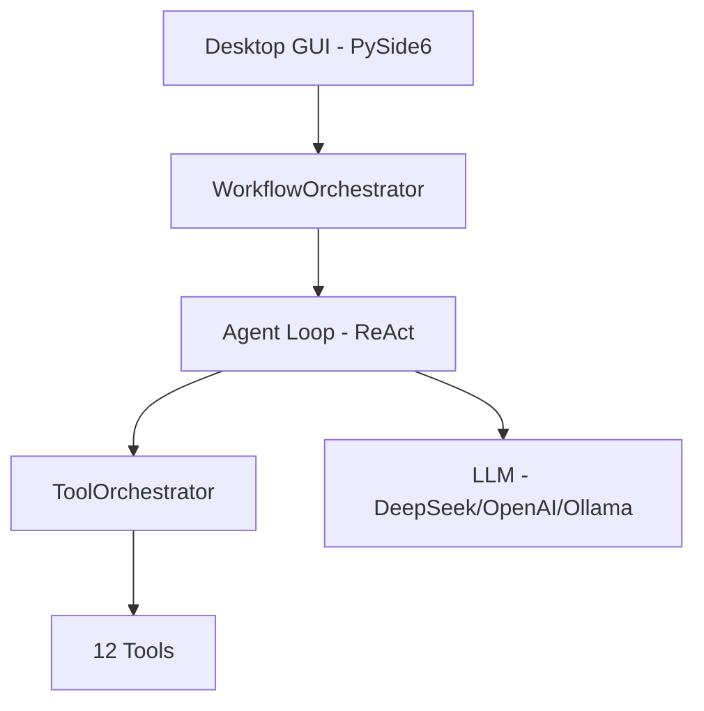

# Morphix

**AI-powered coding assistant with multi-agent orchestration.** Desktop GUI backed by PostgreSQL. Optional Redis cache and Ollama offline mode. Also serves as an MCP server.

[Get Started](getting-started.md){ .md-button .md-button--primary }
[User Guide](user-guide/index.md){ .md-button }

---

## What is Morphix?

Morphix is a desktop application that helps you write, test, and refactor code using AI. Unlike single-model chatbots, Morphix orchestrates **multiple specialized agents** working together through structured workflows — from simple conversations to full multi-agent orchestration with DAG-based parallel execution.

## Key Features

| Feature | Description |
|---------|-------------|
| **Multi-Agent Orchestration** | Developer, analyst, architect, and moderator agents collaborate on tasks |
| **4 Workflow Strategies** | Development, Coordinated (DAG), Collaborative (debate), TDD |
| **12 Built-in Tools** | File manager, git, bash, LSP, code execution, search, and more |
| **Safety First** | Sandboxed code execution, circuit breakers, rate limiting, anti-distillation |
| **Workspace Isolation** | PostgreSQL schemas separate projects completely |
| **Desktop GUI** | PySide6 interface with real-time streaming, file editor, and dashboard |
| **MCP Protocol** | Connect external tools or expose Morphix as an MCP server |
| **Memory System** | FAISS vector search with autoDream self-healing |

## Architecture at a Glance



## Project Stats

| Metric | Value |
|--------|-------|
| Python | 3.12, ~19,700 lines |
| Tests | 680 test functions, 76 modules |
| Commits | ~230 across 26 sprints |
| Type checking | mypy — 0 errors, 0 exclusions |
| Coverage | core, llm, agents, tools, orchestration |
| Pre-commit | black, ruff, mypy, YAML, whitespace |

## Documentation Tracks

=== ":material-book-open-page-variant: Users"
    Learn to use Morphix as a coding assistant. Covers the GUI, workflows, agents, tools, projects, and export.

    [User Guide →](user-guide/index.md)

=== ":material-architect: Architects"
    Understand the design and decisions. Covers data flow, workspace system, security model, memory, streaming, and layer architecture.

    [Architecture →](architecture/index.md)

=== ":material-code-tags: Developers"
    Extend Morphix with new tools, agents, workflows, and hooks. Includes setup, conventions, and testing guide.

    [Developer Guide →](developer-guide/index.md)

=== ":material-api: API"
    Browse the code reference. Autogenerated from docstrings using mkdocstrings.

    [API Reference →](api-reference/index.md)

## Quick Start

```bash
git clone https://github.com/morphilab/morphix.git
cd morphix
poetry install --with dev
cp example.env .env
# Edit .env with your DATABASE_URL and API key
poetry run alembic upgrade head
poetry run python run.py
```

See [Getting Started](getting-started.md) for detailed instructions, including database setup and configuration.
